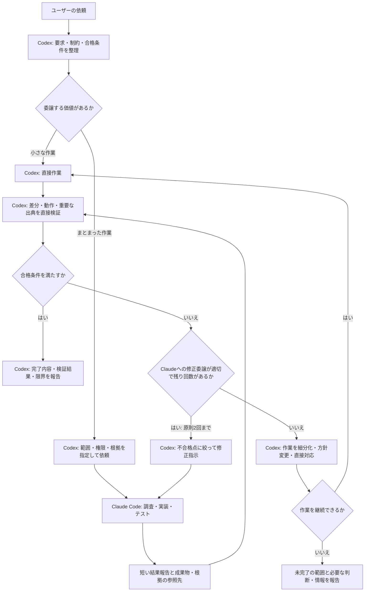

# Claude Orchestrator

Codexが設計と受入検証を担当し、Claude Codeに調査・実装を委譲するCodex用プラグインです。成果物の正確さを優先しながら、Codexが探索や試行錯誤に使うトークンを抑えることを目指します。

## 目的と基本方針

- Codexがユーザーの要求を整理し、実装前に合格条件を決める。
- Claude Codeが、範囲を限定した調査・実装・テスト実行を担当する。
- Codexが報告だけでなく成果物と根拠を直接確認し、最終的な採否を判断する。
- 引き継ぎを短く保ち、必要な箇所だけ追加確認して、同じ調査の繰り返しを減らす。
- 小さな作業は、委譲の負担を考慮してCodexが直接処理する。

品質の保証や、両者を合計したトークン削減を約束するものではありません。難しい案件では検証と修正に消費が増えても、合格条件を維持します。

## 役割分担

| 担当 | 責任 |
| --- | --- |
| ユーザー | 目的、要求、制約を伝える |
| Codex | 要件整理、設計、作業分割、合格条件、委譲判断、独立した検証、最終報告 |
| Claude Code | 指定範囲の探索、資料収集、実装、テスト実行、根拠と未解決事項の報告 |

Claude Codeも実装中の局所的な判断は行います。設計方針の変更や最終的な受入判断はCodexが担当します。

## 処理フロー



認証不足や権限不足で実行できない場合も、完了として扱いません。必要な対応を報告し、権限を迂回せずに解消します。

## 品質を保つ仕組み

### 実装から独立した合格条件

Codexがユーザーの要求から合格条件を作ります。Claudeが実装とテストの両方を作った場合に、同じ勘違いが両方へ入り込むことを考慮します。

### 成果物と根拠の直接確認

実装では変更範囲や差分を確認し、必要な独立チェックを実行します。調査では結論を左右する一次資料を開き、日付や適用条件を確認します。Claudeの完了報告やプロセスの正常終了だけでは合格にしません。

### 修正回数と権限の管理

修正の委譲は原則として1タスクにつき2回までです。改善しない場合はCodexが作業を細分化するか、方針を変えるか、直接引き取ります。公開・送信・デプロイなどの権限が、委譲によって追加されることはありません。

## トークン消費の考え方

Claudeからの報告は通常500語以内を目安とし、以下に絞ります。

- 結果と変更ファイル、または調査の結論
- 合格条件に対応するテスト結果・出典
- 仮定、失敗した確認、未解決事項、必要な判断
- 詳細ログや成果物の保存先

詳細ログをすべてCodexへ取り込まず、必要な部分を追加で読みます。ただし、正確さに必要な確認は省略しません。削減効果は実タスクで測定し、取得できない使用量や削減率は推測で報告しません。

## 構成と実行方式

```text
claude-orchestrator/
├── .codex-plugin/
│   └── plugin.json
├── skills/
│   └── claude-orchestrator/
│       └── SKILL.md
├── .gitignore
├── INSTALL.md
└── README.md
```

- [plugin.json](.codex-plugin/plugin.json): プラグインの名前、表示情報、スキルの場所
- [SKILL.md](skills/claude-orchestrator/SKILL.md): Codexが読み込む委譲・検証ルール
- [INSTALL.md](INSTALL.md): 登録、インストール、更新手順

現状はスキルの指示に従ってCodexがシェル経由でClaude Codeを呼び出す構成です。独自の実行スクリプトやMCPサーバーは含んでいません。基本となる呼び出しは `claude -p --output-format json` で、利用可能なオプションや権限は実行時に確認します。

このスキルは運用ルールであり、ルールを強制する専用の実行基盤ではありません。Claude Codeは外部プロセスなので、Codexのサンドボックスが自動的に引き継がれる前提では扱いません。

## 導入と使い方

前提は、Codexでローカルプラグインとシェルを利用できること、およびClaude Codeがインストール・認証済みであることです。Claudeのモデルは、別途指定しない限り既存の設定を使います。

[INSTALL.md](INSTALL.md)に従って登録・インストールし、新しいCodexタスクで依頼します。

> claude-orchestratorを使って、この変更を実装して。設計と受入検証はCodex、調査と実装はClaude Codeに任せて。品質を優先して、Codexの消費を抑えて。

調査の場合の例:

> claude-orchestratorを使って、この機能の実装方法を調査して。Claude Codeが資料を集め、Codexが重要な一次資料を確認して採用案を判断して。

## Gitでの改善と反映

取得したこのリポジトリを編集元とします。

1. `SKILL.md` やマニフェストを編集する。
2. スキルとプラグインの形式を検証し、変更したルールが要求と一致するか確認する。
3. Gitで差分を確認してコミットする。
4. インストール先へ反映し、キャッシュ更新用のバージョン識別子を更新して再インストールする。
5. 新しいCodexタスクで反映を確認する。

具体的なコマンドは[INSTALL.mdの更新手順](INSTALL.md#gitでの継続開発)を参照してください。インストール先のコピーやCodexのキャッシュを直接の編集元にはしません。

改善時は、合格条件の達成、見落とし、修正回数、処理時間、取得できる範囲の使用量を記録します。節約だけを理由に検証を薄くせず、実際の失敗や無駄に対応する変更を加えます。
