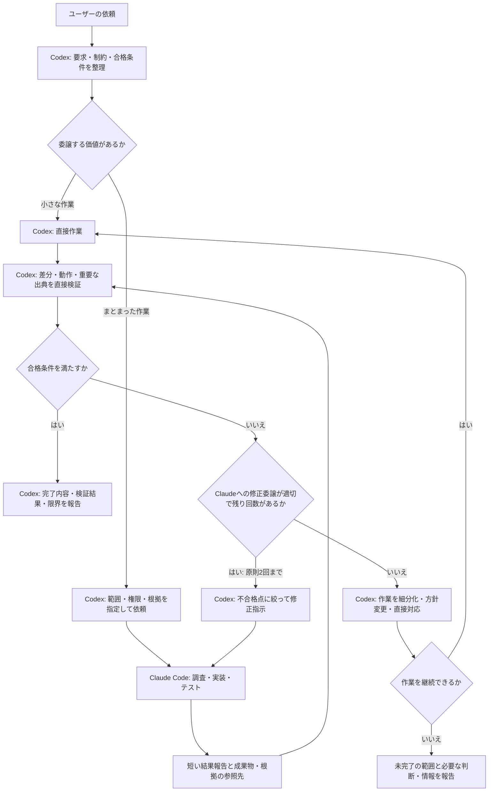

# Claude Orchestrator

Codexが設計と受入検証を担当し、Claude Codeに調査・実装を委譲するCodex用プラグインです。成果物の正確さを優先しながら、Codexが探索や試行錯誤に使うトークンを抑えることを目指します。

## 目的と基本方針

- Codexがユーザーの要求を整理し、実装前に合格条件を決める。
- Claude Codeが、範囲を限定した調査・実装・テスト実行を担当する。
- Codexが報告だけでなく成果物と根拠を直接確認し、最終的な採否を判断する。
- 引き継ぎを短く保ち、必要な箇所だけ追加確認して、同じ調査の繰り返しを減らす。
- 小さな作業は、委譲の負担を考慮してCodexが直接処理する。

品質の保証や、両者を合計したトークン削減を約束するものではありません。難しい案件では検証と修正に消費が増えても、合格条件を維持します。

## 役割分担

| 担当 | 責任 |
| --- | --- |
| ユーザー | 目的、要求、制約を伝える |
| Codex | 要件整理、設計、作業分割、合格条件、委譲判断、独立した検証、最終報告 |
| Claude Code | 指定範囲の探索、資料収集、実装、テスト実行、根拠と未解決事項の報告 |

Claude Codeも実装中の局所的な判断は行います。設計方針の変更や最終的な受入判断はCodexが担当します。

## 処理フロー



認証不足や権限不足で実行できない場合も、完了として扱いません。必要な対応を報告し、権限を迂回せずに解消します。

### 認証エラー時の対応と報告

認証エラーは「この実行環境では認証できなかった」という観測として報告し、それだけで利用者が未ログインとは断定しません。ログイン済みとの申告と確認結果が矛盾するときは、呼び出し元のプロセス、サンドボックス、設定などの実行環境の違いも原因の候補として切り分けます。未確認の原因は断定しません。

Codexが直接引き取る前に、既存の権限・承認手順の範囲で次の順に復旧を試みます。

1. 実行環境の違いが疑われる場合、最初の環境と、通常の承認を得た外部環境とで `claude auth status`（または対応するコマンド）の結果を比べる。確認するのは成否だけで、認証情報の表示・複製・抽出は行わない。
2. 外部環境でも認証できない場合は、確認した両環境で認証を確認できなかったと報告し、原因は断定しない。必要かつ許可された追加診断を評価し、残る診断がなければ制約を報告してCodexによる直接対応を検討する。
3. 外部環境で認証できて、元の委譲が未完了で、対象コードの送信・パス・操作がすでに許可されているなら、元の委譲の再実行を通常の実行承認へ実際に申請する。提案だけで止めない。申請には許可の根拠、委譲先（Claude Codeと利用する外部サービス）、対象パスやデータ、許可する操作とツールを記載する。すでに許可された範囲をユーザーへ再確認はしませんが、実行承認は引き続き必要です。
4. 再実行の範囲は元の依頼どおりに絞る。外部プロセスはCodexのサンドボックスを引き継がないため、外側の広い権限をそのまま使わない。

単なる「動作確認」が目的のときは、ユーザーのコードではなく最小限の合成タスクを使います。逆に、元の作業がすでに完了している場合は、復旧の実演のために作業をやり直しません。

承認が拒否された場合や再実行が失敗した場合は、到達した段階と理由を報告し、Codexによる直接対応を検討します。認証情報の複製、サンドボックスの全体的な無効化、拒否の迂回、一律の再ログイン案内は行いません。追加診断が許可されない場合は、確認できた事実と残る制約を説明します。正常に委譲できている場合は、このための追加確認は不要です。

報告では、認証状態の確認、最小合成タスクの成功、元の委譲本体の正常終了、成果の独立検証を区別し、実施した段階だけを述べます。認証確認だけでは委譲成功としません。最初の環境で認証を直したのか、承認された外部環境での実行によって復旧したのかも区別します。

| 実際に確認した段階 | 報告例 |
| --- | --- |
| 委譲が認証エラーで失敗。その後の認証確認は成功したが、本体は再試行していない | 認証状態は確認できました。委譲本体は再試行しておらず、委譲の復旧は未検証です。 |
| 最初の環境では認証できなかったが、承認された外部環境で本体が正常終了し、Codexが成果を独立検証した | 承認された外部環境で委譲本体を再実行し、成果を独立検証しました。委譲の復旧を確認しました（最初の環境の認証自体は未解決です）。 |
| 外部環境でも認証確認に失敗 | 確認した両環境で認証を確認できませんでした。委譲は復旧しておらず、原因は未特定です。 |
| 認証確認は成功したが、再実行の実行承認が拒否された | 認証状態は確認できましたが、再実行の申請は承認されませんでした（理由: ...）。委譲は復旧していないため、Codexでの直接対応を検討します。 |
| 認証確認は成功したが、本体の再試行も失敗 | 認証状態は確認できましたが、委譲本体の再試行も失敗しました。委譲は復旧していません。 |
| 最小の合成タスクだけ成功し、本体は実行していない | 最小の合成タスクは正常終了しました。元の委譲本体は実行しておらず、その成否は未検証です。 |
| 元の委譲対象の作業がすでに完了している | 対象の作業は完了済みのため再実行しません。委譲経路の復旧は未検証です。 |

Codexが直接作業を引き取った場合は、実際の担当がCodexであることを明示します。この手順を変更するときは、上の各シナリオで報告内容を検証します。手順の文面検証と実環境での動作検証を区別し、実施していない検証を成功扱いしません。

## 品質を保つ仕組み

### 実装から独立した合格条件

Codexがユーザーの要求から合格条件を作ります。Claudeが実装とテストの両方を作った場合に、同じ勘違いが両方へ入り込むことを考慮します。

### 成果物と根拠の直接確認

実装では変更範囲や差分を確認し、必要な独立チェックを実行します。調査では結論を左右する一次資料を開き、日付や適用条件を確認します。Claudeの完了報告やプロセスの正常終了だけでは合格にしません。

### 修正回数と権限の管理

修正の委譲は原則として1タスクにつき2回までです。改善しない場合はCodexが作業を細分化するか、方針を変えるか、直接引き取ります。公開・送信・デプロイなどの権限が、委譲によって追加されることはありません。

## トークン消費の考え方

Claudeからの報告は通常500語以内を目安とし、以下に絞ります。

- 結果と変更ファイル、または調査の結論
- 合格条件に対応するテスト結果・出典
- 仮定、失敗した確認、未解決事項、必要な判断
- 詳細ログや成果物の保存先

詳細ログをすべてCodexへ取り込まず、必要な部分を追加で読みます。ただし、正確さに必要な確認は省略しません。削減効果は実タスクで測定し、取得できない使用量や削減率は推測で報告しません。

## 構成と実行方式

```text
claude-orchestrator/
├── .codex-plugin/
│   └── plugin.json
├── skills/
│   ├── claude-orchestrator/
│   │   └── SKILL.md
│   └── improve-claude-orchestrator/
│       └── SKILL.md
├── .gitignore
├── INSTALL.md
└── README.md
```

- [plugin.json](.codex-plugin/plugin.json): プラグインの名前、表示情報、スキルの場所
- [SKILL.md](skills/claude-orchestrator/SKILL.md): Codexが読み込む委譲・検証ルール
- [改善用スキル](skills/improve-claude-orchestrator/SKILL.md): このプラグインの改善点をIssueに登録し、指定Issueの修正・PR作成を進めるルール
- [INSTALL.md](INSTALL.md): 登録、インストール、更新手順

現状はスキルの指示に従ってCodexがシェル経由でClaude Codeを呼び出す構成です。独自の実行スクリプトやMCPサーバーは含んでいません。基本となる呼び出しは `claude -p --output-format json` で、利用可能なオプションや権限は実行時に確認します。

このスキルは運用ルールであり、ルールを強制する専用の実行基盤ではありません。Claude Codeは外部プロセスなので、Codexのサンドボックスが自動的に引き継がれる前提では扱いません。

## 導入と使い方

前提は、Codexでローカルプラグインとシェルを利用できること、およびClaude Codeがインストール・認証済みであることです。Claudeのモデルは、別途指定しない限り既存の設定を使います。

[INSTALL.md](INSTALL.md)に従って登録・インストールし、新しいCodexタスクで依頼します。

> claude-orchestratorを使って、この変更を実装して。設計と受入検証はCodex、調査と実装はClaude Codeに任せて。品質を優先して、Codexの消費を抑えて。

調査の場合の例:

> claude-orchestratorを使って、この機能の実装方法を調査して。Claude Codeが資料を集め、Codexが重要な一次資料を確認して採用案を判断して。

### 委譲の許可と実行申請

現在の会話での明示的な依頼や適用される既存の指示を、委譲許可の根拠として扱います。対象コードをClaudeへ調査・実装委譲する許可が明確なら、同じ範囲についてAGENTS.mdへの追記や再確認を必須にしません。非公開コードを含め、Claude Codeが利用する外部サービスへのコード送信が許可の範囲に含まれるかを確認し、実行申請には許可の根拠、委譲先、対象パスやデータ、操作内容を具体的に示します。

単なる「動作確認」の依頼では任意の非公開コードの送信を許可されたとは扱わず、最小限の合成例を使います。コードの委譲許可を認証情報・秘密値・顧客の実データの送信やコミット・公開・デプロイへ広げません。範囲を広げる場合や別の会話では、許可の根拠を改めて評価します。スキル自体が許可を与えるものではありません。

通常の実行承認は維持します。拒否された場合は理由を確認し、既存の許可の根拠を補足するか、許可された範囲の代替手段を検討します。拒否を迂回せず、解消できない場合は拒否された操作と理由を説明します。自動承認の成功や、今後一切停止しないことは保証しません。

## Gitでの改善と反映

### Issue・PRを使った改善

`improve-claude-orchestrator` は、このプラグイン自体の改善を扱います。利用先プロジェクトのIssue管理には使いません。

利用中に問題を見つけたタスクで、次のように依頼します。

> improve-claude-orchestratorを使って、今回の引き継ぎと再調査の重複を改善Issueとして登録して。期待した動き、実際の例、受入条件を整理して。実装はまだ進めないで。

登録先は `makonishi/claude-orchestrator` です。既存Issueを確認して重複を避け、会話全文や利用先プロジェクトの機密情報は転載しません。GitHubへのアクセスには、認証済みのGitHub連携または `gh` が必要です。

対応するときは、開発リポジトリを開いて依頼します。

> improve-claude-orchestratorを使って、Issue #123を修正し、検証してPRを作成して。

専用ブランチで修正し、PRに検証結果とIssueへの関連付けを記載します。マージと利用環境への反映は別途依頼します。反映後は新しいCodexタスクで問題が改善したか確認してください。

### ローカルでの反映

取得したこのリポジトリを編集元とします。

1. `SKILL.md` やマニフェストを編集する。
2. スキルとプラグインの形式を検証し、変更したルールが要求と一致するか確認する。
3. Gitで差分を確認してコミットする。
4. インストール先へ反映し、キャッシュ更新用のバージョン識別子を更新して再インストールする。
5. 新しいCodexタスクで反映を確認する。

具体的なコマンドは[INSTALL.mdの更新手順](INSTALL.md#gitでの継続開発)を参照してください。インストール先のコピーやCodexのキャッシュを直接の編集元にはしません。

改善時は、合格条件の達成、見落とし、修正回数、処理時間、取得できる範囲の使用量を記録します。節約だけを理由に検証を薄くせず、実際の失敗や無駄に対応する変更を加えます。
